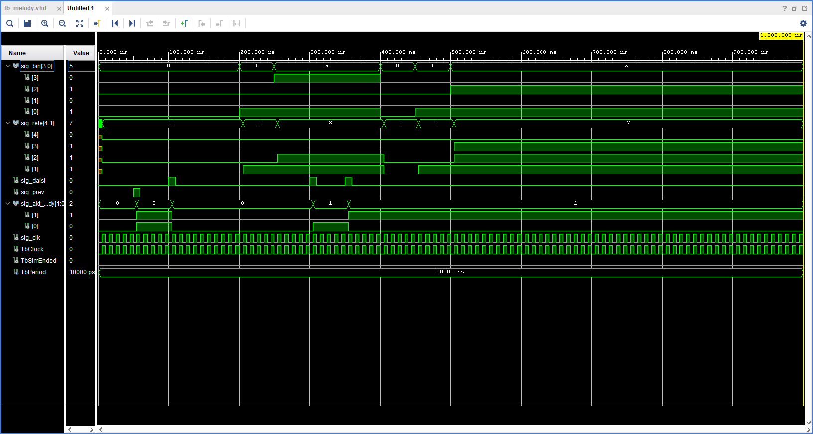

# VHDL_Project
* Jakub Švaříček
* Tereza Kalinová
* Vít Charvátek

## Teoretický popis

*  Cílem projektu bylo vytvořit audio syntezátor, který produkuje melodie za použití relé.
*  Zvuk by měl produkovat relé modul připojený k Pmod konektorům.
*  Vytvoření melodie za pomocí spínání a rozepínání
*  Lze naprogramovat libovolnou melodii
*  Navigace mezi melodiemi za pomocí tlačítek
*  Číslo melodie zobrazit na segmentovém displeji
*  Použít 16 LED pro zobrazení průběhu melodie

## Popis hardware použitého při porjektu

K vytovoření funkčního modelu byla použita deska Digilent Nexys A7-50T, dále bylo použito Arduino UNO, které sloužilo jako zdroj 5V napětí, dvoukanálový relé modul a propojovací vodiče.

* Nexys A7-50T

  

* Arduino UNO

  Arduino UNO je připojeno k desce Nexys pomocí USB a slouží pouze jako zdroj 5V a 3.3V napětí. Na kontaktním nepájivem poli se také nachazí převodník logické úrovně 5V na 3.3V. Ten umožnuje ovládat relé modul, který požaduje pro sepnutí 5V pomocí desky Nexys, jejíž digitální výstupy mají pouze 3.3V.

* Relé modul

  Relé modul se skládá ze čtyř relé spínaných pomocí 5V signálu a základního obvodu pro signalizaci sepnutí pomocí LED.
Spínací obvod i všechny relé jsou osazeny na tištěném spoji. Pro ovládání a napájení slouží 6 pinů. 2 pro +5V a GND a 4 pro spínání jednotlivých relé.

## Popis software

Schéma top level

### Simulace komponent

bin2seven

Převádí binární kód na signál pro zobrazení na sedmi segmentovém displeji

clock_enable

Generuje časový signál

debounce

Generuje časový signál

pausePlay

Při stisku tlačítka zastaví melodii

bin2seg

melody

Zde jsou zaznamenány jednotlivé melodie

simple_counter

16bitový čítač 

## Ovládání
Pomocí tlačítek na desce lze přepínat melodie, pozastavit přehrávání a přeskakovat o 4 doby.
Na sedmi segmentovém displeji se zobrazuje číslo přehrávané melodie.
16 LED na spodní části desky zobrazuje v jaké části melodie se momentálně nachází.

